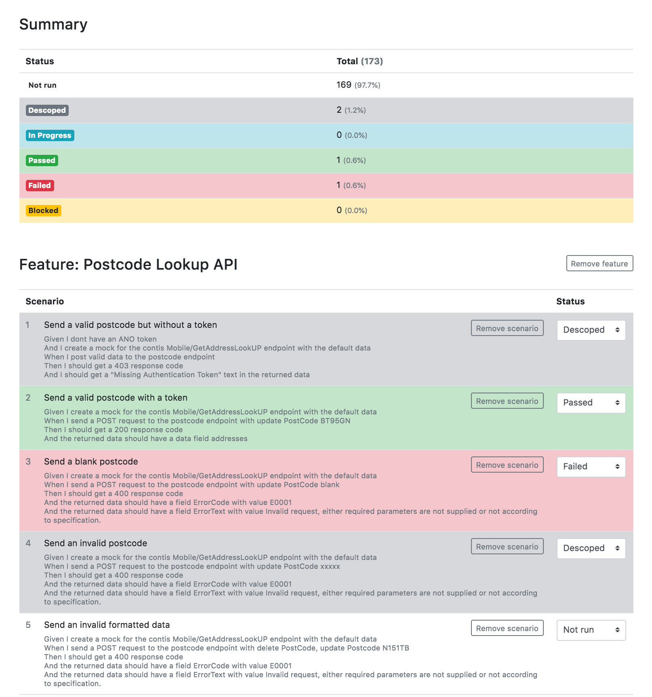

# Pumpkin 🎃

This application generates a test report directly from your gherkin feature files, so that your scenarios can be used as tests without the need for automation with Cucumber. If you have already automated some of your scenarios, the script accepts a Cucumber report (JSON) and it will pre-selet the pass/fail status of those implemented scenarios so that you can fill in the rest manually.

## Installation

1. Clone the repo
2. Run `bundle install` to install the dependencies

## Usage

Run the script as follows:

    $ ruby pumpkin.rb --features /path/to/your/features/directory

The script accepts the following arguments:

* `--features` (or `-f`) is the path to a local directory of gherkin feature files
* `--cucumberjson` (or `-c`) is the path to a local JSON file containing a Cucumber test report (optional)
* `--reporthtml` (or `-r`) is the path to a previous pumpkin HTML report (optional)
* `--open` (or `-o`) to open the HTML report in your browser after the script completes
* `--title` (or `-t`) to set the report title
* `--date` (or `-d`) to set the report date/time
* `--notes` (or `-n`) to set the report notes, use "\n" to add newlines
* `--exclude` (or `-e`) a space-separated list of tags to exclude e.g. "@wip @regression"

### Saving your results

Pumpkin generates a single HTML file inside which you record the status of each scenario (Descoped, In Progress, Passed, Failed or Blocked). You can set the status for every scenario within a feature, or set each scenario individually. When you're finished, or you want to save your work, click the "Save HTML" button at the top. Your browser will download a new HTML file containing all of your changes. Open this file and carry on making further changes in the future.

The best way to share the report is to generate a PDF by printing it. Pumpkin has a print stylesheet that will create a nice, clean, client-friendly report.

### Altering the order of features

By default the features will appear in the report in the same order that the files are ordered on your computer (alphabetically). To override this order use the `@report-order-N` tag on each feature. Tagged features will appear first, then the others ordered alphabetically. For example:

    @report-order-1
    Feature: Login
    ...

    @report-order-2
    Feature: Registration
    ...

### Pre-populating scenario status from a Cucumber report

If you pass the path to a Cucumber test run output (`--cucumberjson`) the script will attempt to find the pass/fail status from this file by matching the feature and scenario names.

### Pre-populating scenario status from a previous HTML report

If you pass the path to a previous HTML report generated by this script (`--reporthtml`), it will attempt to find the scenario status by matching the scenario name. For example:

    $ ruby pumpkin.rb --features /path/to/your/features/directory --reporthtml /path/to/another/report.html

## Example

